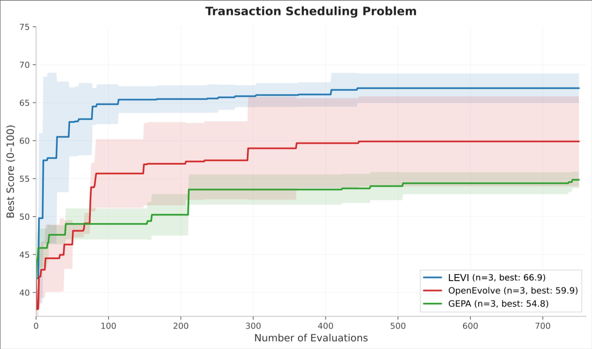

<p align="center">
  
  
</p>

<p align="center"><strong>AlphaEvolve Performance for the Price of a Cup of Coffee</strong></p>

<p align="center">
  <a href="https://github.com/ttanv/levi/actions/workflows/ci.yml?query=branch%3Amain"></a>
  <a href="https://www.python.org/downloads/"></a>
  <a href="LICENSE"></a>
  <a href="https://ttanv.github.io/levi"></a>
</p>

---

LEVI is an LLM-guided evolutionary framework for discovering algorithms, heuristics, and optimized code. Most frameworks in this space require expensive frontier models and large budgets to produce good results. LEVI doesn't — point it at a scoring function, set a dollar budget, and walk away.

**$4.50 improves on what other frameworks need $15-30 and frontier models to achieve** across a [variety of problems](https://ucbskyadrs.github.io/), at a fraction of the cost.

## Why LEVI

Existing frameworks couple performance tightly to model capability. Drop to a smaller model and results degrade sharply. LEVI decouples the two by making **diversity an architectural concern** rather than a model concern, and by matching model capacity to task demand.

Cheap models handle the bulk of mutation work. A behavioral archive keeps structurally different strategies alive, preventing premature convergence. Periodic paradigm shifts from a stronger model inject genuinely new ideas. The result: you spend less and get more.


<p align="center">
  
  
</p>
<p align="center"><em>LEVI converges faster and scores higher than baselines on controlled equal-budget comparisons (same model, 750 evals).</em></p>

## Quickstart

```bash
# Install uv first: https://docs.astral.sh/uv/getting-started/installation/
git clone https://github.com/ttanv/levi.git
cd levi
uv sync
```

A full LEVI program:

```python
import levi

def score_fn(pack):
    bins = pack([4, 8, 1, 4, 2, 1], 10)
    wasted = sum(10 - sum(b) for b in bins)
    return {"score": max(0.0, 100.0 - wasted)}

result = levi.evolve_code(
    "Optimize bin packing to minimize wasted space",
    function_signature="def pack(items, bin_capacity):",
    score_fn=score_fn,
    model="openai/gpt-4o-mini",
    budget_dollars=2.0,
)
```

Or start with `examples/circle_packing/run.py` — the simplest end-to-end example.

## Suggested Starting Points

- Start here: `examples/circle_packing/` for a self-contained local-first run.
- First ADRS run: `examples/ADRS/prism/` or `examples/ADRS/llm_sql/` if you want to avoid cloning the ADRS dataset first.
- Try `prompt_opt`: `examples/ADRS/cant_be_late/`
- Try `init` + `prompt_opt` + punctuated equilibrium together: `examples/ADRS/cant_be_late_multi/`

## Results

LEVI holds the **highest average score (76.5)** across all seven [ADRS Leaderboard](https://ucbskyadrs.github.io/) problems, ahead of GEPA (71.9), OpenEvolve (70.6), and ShinkaEvolve (67.4). Six of the seven problems were solved on a **$4.50 budget**.

| Problem | LEVI | Best Other Framework | Saving |
|---------|------|----------------------|--------|
| Spot Single-Reg | **51.7** | GEPA 51.4 | 6.7x cheaper |
| Spot Multi-Reg | **72.4** | OpenEvolve 66.7 | 5.6x cheaper |
| LLM-SQL | **78.3** | OpenEvolve 72.5 | 4.4x cheaper |
| Cloudcast | **100.0** | GEPA 96.6 | 3.3x cheaper |
| Prism | **87.4** | GEPA / OpenEvolve / ShinkaEvolve 87.4 | 3.3x cheaper |
| EPLB | **74.6** | GEPA 70.2 | 3.3x cheaper |
| Txn Scheduling | **71.1** | OpenEvolve 70.0 | 1.5x cheaper |

<p align="center">
  
  
</p>

LEVI scored **2.6359+ packing density** on the n=26 circle packing benchmark, with a local model handling the majority of mutations. See [`examples/circle_packing`](examples/circle_packing) for the full setup.

## How It Works

1. **Seed & score.** You provide a starting program and a scoring function. LEVI generates diverse variants to populate a behavioral archive.
2. **Evolve.** Cheap models mutate and refine solutions in parallel. The behavioral archive keeps structurally different strategies alive, preventing convergence.
3. **Paradigm shifts.** Periodically, a stronger model proposes entirely new algorithmic approaches based on the archive's best ideas.
4. **Budget stops.** LEVI tracks spend in real time and stops when your dollar, evaluation, or time cap is hit.

Read more in the [full writeup](https://ttanv.github.io/levi/docs#how-it-works).

## Further Reading

- [Documentation](https://ttanv.github.io/levi) — API reference, configuration, architecture details, and ablations.
- [LEVI: LLM-Guided Evolutionary Search Needs Better Harnesses, Not Bigger Models](https://ucbskyadrs.github.io/blog/levi/) — The full blog post on the ADRS site.

## Citation

If you use LEVI in your research, please cite:

```bibtex
@software{tanveer2026levi,
  title  = {LEVI: LLM-Guided Evolutionary Search Needs Better Harnesses, Not Bigger Models},
  author = {Tanveer, Temoor},
  url    = {https://github.com/ttanv/levi},
  year   = {2026}
}
```

Contact: ttanveer@alumni.cmu.edu
