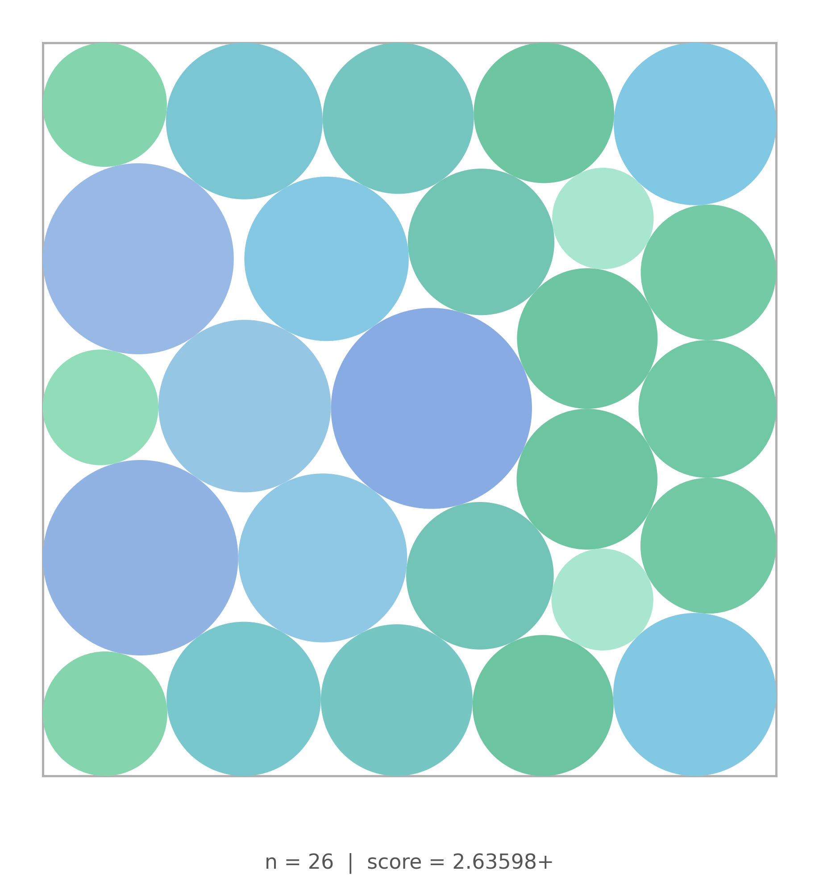

<p align="center">
  
  
</p>

<p align="center"><strong>Better LLM Optimization for the Price of a Cup of Coffee</strong></p>

<p align="center">
  <a href="https://github.com/ttanv/algoforge/actions/workflows/ci.yml?query=branch%3Amain"></a>
  <a href="https://www.python.org/downloads/"></a>
  <a href="LICENSE"></a>
  <a href="https://ttanv.github.io/levi"></a>
</p>

---

LEVI is an LLM-guided evolutionary framework for discovering algorithms, heuristics, and optimized code. Point it at a scoring function and a seed program, set a dollar budget, and walk away.

## Why LEVI

Existing frameworks couple performance tightly to model capability. Drop to a smaller model and results degrade sharply. LEVI decouples the two by making diversity an architectural concern rather than a model concern, and by matching model capacity to task demand: cheap models for refinement, expensive models only for periodic creative leaps. Set a dollar budget and LEVI spends it well.

**$4.50 improves on what other frameworks need $15-30 and frontier models to achieve.** Highest scores on the [ADRS benchmark](https://ucbskyadrs.github.io/) across all frameworks. See [detailed results](https://ttanv.github.io/levi).

<p align="center">
  
  
</p>
<p align="center"><em>LEVI converges faster and scores higher than baselines on controlled equal-budget comparisons (ADRS problems, same model, 750 evals).</em></p>

## Quickstart

LEVI is not on PyPI yet. Install it from source:

```bash
git clone https://github.com/ttanv/algoforge.git
cd algoforge
uv sync
```

Run it as simply as below:

```python
import levi 

def score_fn(pack, test_cases):
    items, capacity = test_cases[0]
    bins = pack(items, capacity)
    wasted = sum(capacity - sum(b) for b in bins)
    return {"score": max(0.0, 100.0 - wasted)}

inputs = [([4, 8, 1, 4, 2, 1], 10)]

result = levi.evolve_code(
    "Optimize bin packing to minimize wasted space",
    function_signature="def pack(items, bin_capacity):",
    seed_program="def pack(items, bin_capacity):\n    return [[item] for item in items]",
    score_fn=score_fn,
    inputs=inputs,
    model="openai/gpt-4o-mini",
    budget_dollars=2.0,
)
```

## API

The main entry point is `levi.evolve_code(...)`.

- Required arguments: `problem_description`, `function_signature`, `seed_program`, `score_fn`
- Model selection: pass either `model=...` or `paradigm_model=...` / `mutation_model=...`
- Budgeting: pass at least one of `budget_dollars`, `budget_evals`, or `budget_seconds`
- Scoring: `score_fn` may be either `score_fn(fn)` or `score_fn(fn, inputs)`, and must return a dict containing `{"score": float}`

`evolve_code(...)` returns a `levi.LeviResult` with:

- `best_program: str`
- `best_score: float`
- `runtime_seconds: float`
- `score_history: list[float] | None`
- ...

## How It Works

1. **Seed & score.** You provide a starting program and a scoring function. LEVI generates diverse variants to populate a behavioral archive.
2. **Evolve.** Cheap models mutate and refine solutions in parallel. A behavioral archive keeps structurally different strategies alive, preventing convergence.
3. **Paradigm shifts.** Periodically, a stronger model proposes entirely new algorithmic approaches based on the archive's best ideas.
4. **Budget stops.** LEVI tracks spend in real time and stops when your dollar, evaluation, or time cap is hit.

Read the [full writeup](https://ttanv.github.io/levi) for architecture details and ablations.

## Configuration

### Model specification

```python
# Single model for everything
result = levi.evolve_code(..., model="openai/gpt-4o-mini")

# Separate paradigm (creative) and mutation (workhorse) models
result = levi.evolve_code(
    ...,
    paradigm_model=["openai/gpt-4o"],
    mutation_model=["openai/gpt-4o-mini"],
)
```

Hosted models should use [LiteLLM](https://docs.litellm.ai/docs/providers) identifiers such as `openai/gpt-4o-mini` or `openrouter/google/gemini-3-flash-preview`. Self-hosted models can use any stable name if you map that name through `local_endpoints`.

### Budget

```python
result = levi.evolve_code(..., budget_dollars=5.0)   # cost cap
result = levi.evolve_code(..., budget_evals=200)      # evaluation cap
result = levi.evolve_code(..., budget_seconds=3600)   # time cap
```

### Advanced configuration

```python
result = levi.evolve_code(
    ...,
    pipeline=levi.PipelineConfig(n_llm_workers=8, n_eval_processes=8),
    behavior=levi.BehaviorConfig(ast_features=["cyclomatic_complexity", "branch_count"]),
    punctuated_equilibrium=levi.PunctuatedEquilibriumConfig(enabled=True, interval=5),
    prompt_opt=levi.PromptOptConfig(enabled=True),
)
```

See `levi.LeviConfig` for the full list of configuration options.

## ADRS Benchmark

LEVI holds the **highest average score (76.5)** across all seven [ADRS Leaderboard](https://ucbskyadrs.github.io/) problems, ahead of GEPA (71.9), OpenEvolve (70.6), and ShinkaEvolve (67.4). Six of the seven problems were solved on a **$4.50 budget**, 3-7x cheaper than baselines that typically spend $15-30 per problem. On controlled equal-budget comparisons, LEVI reaches near-peak performance up to 12× faster in sample efficiency.

| Problem | LEVI | 2nd Best | Saving (over 2nd best) |
|---------|------|----------|-----------------------|
| Spot Single-Reg | **51.7** | GEPA 51.4 | 6.7x cheaper |
| Spot Multi-Reg | **72.4** | GEPA 62.2 | 5.6x cheaper |
| LLM-SQL | **78.3** | OpenEvolve 72.5 | 4.4x cheaper |
| Cloudcast | **100.0** | GEPA 96.6 | 3.3x cheaper |
| Prism | **87.4** | Tied | 3.3x cheaper |
| EPLB | **74.6** | GEPA 70.2 | 3.3x cheaper |
| Txn Scheduling | **71.1** | OpenEvolve 70.0 | 1.5x cheaper |

See [detailed results and methodology](https://ttanv.github.io/levi).

## Circle Packing: Local Models, Real Results

<p align="center">
  
</p>

LEVI scored **2.6359+ packing density** on the n=26 circle packing benchmark on a **$15 budget**. The mutation models were a local Qwen3-30B-A3B and Xiaomi MiMo-v2-Flash, with Gemini 3 Flash handling periodic paradigm shifts, with the majority of accepted mutations coming from the local Qwen. See [`examples/circle_packing`](examples/circle_packing) for the full setup.

## Examples

Examples live under [`examples/README.md`](examples/README.md):
Each example directory uses `run.py` as its entrypoint.

- `examples/circle_packing/` is a self-contained optimization example
- `examples/ADRS/` contains seven worked [ADRS Leaderboard](https://ucbskyadrs.github.io/) problems covering cloud scheduling, GPU placement, broadcast optimization, and more
