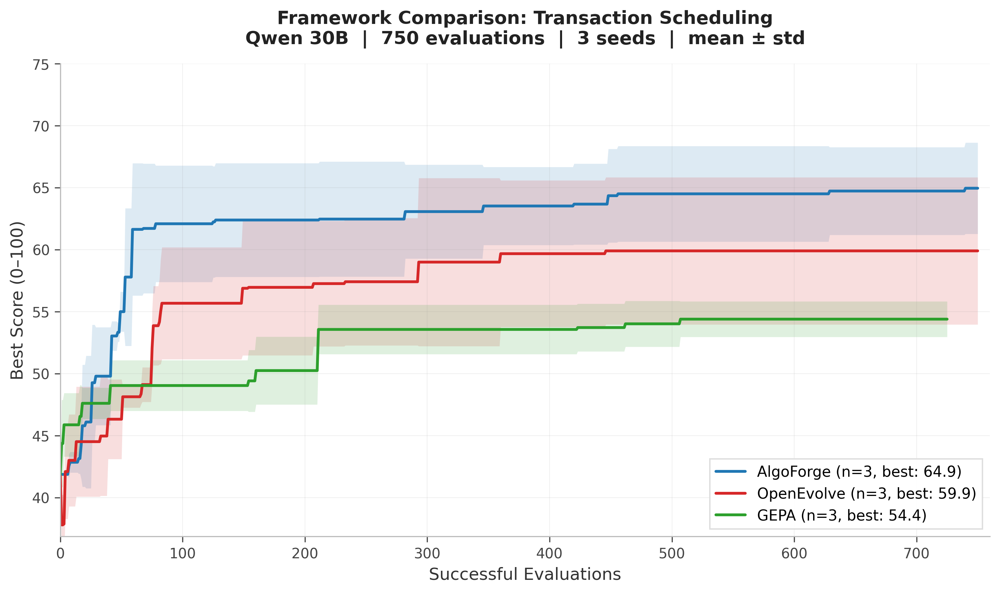
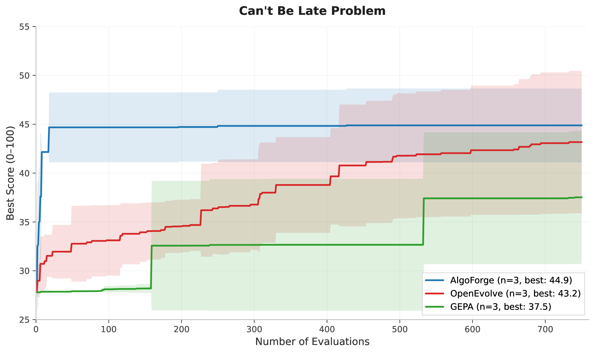

# Levi

**Better LLM Optimization for the Price of a Cup of Coffee**

[](https://github.com/ttanv/algoforge/actions/workflows/ci.yml)
[](https://www.python.org/downloads/)
[](LICENSE)

Levi is an LLM-guided evolutionary framework for discovering algorithms, heuristics, and optimized code. Point it at a scoring function and a seed program, set a dollar budget, and walk away.

## Why Levi

Existing frameworks couple performance tightly to model capability. Drop to a smaller model and results degrade sharply. Levi decouples the two by making diversity an architectural concern rather than a model concern, and by matching model capacity to task demand: cheap models for refinement, expensive models only for periodic creative leaps. Set a dollar budget and Levi spends it well.

**$4.50 improves on what other frameworks need $15–30 and frontier models to achieve.** Highest scores on the [ADRS benchmark](https://github.com/cmu-db/ADRS-Leaderboard) across all frameworks. See [detailed results](https://ttanv.github.io/levi).

## Quickstart

Levi is not on PyPI yet. Install it from source:

```bash
git clone https://github.com/ttanv/algoforge.git
cd algoforge
uv sync
```

Run it as simply as below:

```python
import levi 

def score_fn(pack, test_cases):
    items, capacity = test_cases[0]
    bins = pack(items, capacity)
    wasted = sum(capacity - sum(b) for b in bins)
    return {"score": max(0.0, 100.0 - wasted)}

inputs = [([4, 8, 1, 4, 2, 1], 10)]

result = levi.evolve_code(
    "Optimize bin packing to minimize wasted space",
    function_signature="def pack(items, bin_capacity):",
    seed_program="def pack(items, bin_capacity):\n    return [[item] for item in items]",
    score_fn=score_fn,
    inputs=inputs,
    model="openai/gpt-4o-mini",
    budget_dollars=2.0,
)
```

## API

The main entry point is `levi.evolve_code(...)`.

- Required arguments: `problem_description`, `function_signature`, `seed_program`, `score_fn`
- Model selection: pass either `model=...` or `paradigm_model=...` / `mutation_model=...`
- Budgeting: pass at least one of `budget_dollars`, `budget_evals`, or `budget_seconds`
- Scoring: `score_fn` may be either `score_fn(fn)` or `score_fn(fn, inputs)`, and must return a dict containing `{"score": float}`

`evolve_code(...)` returns a `levi.LeviResult` with:

- `best_program: str`
- `best_score: float`
- `total_evaluations: int`
- `total_cost: float`
- `archive_size: int`
- `runtime_seconds: float`
- `score_history: list[float] | None`

## How It Works

1. **Problem definition** — A natural-language description, a function signature, a seed program, and a scoring function.
2. **Initialization** — Levi generates structurally diverse seed variants and uses them to set up a behavioral archive that maintains diversity across fundamentally different solution strategies.
3. **Evolution loop** — An async pipeline samples parents from the archive, mutates them via LLM calls, evaluates the results, and inserts improvements back. Most mutations are routed to cheap workhorse models for local refinements.
4. **Paradigm shifts** — Periodically, a stronger model is given representative solutions from across the archive and asked to propose structurally different approaches — new algorithmic families rather than incremental improvements.
5. **Budget-aware stopping** — Levi tracks spend in real time and stops when the dollar, evaluation, or time budget is exhausted. No guessing how many iterations to run.

Key concepts:
- **Seed program**: A working (but suboptimal) starting solution.
- **Score function**: Returns `{"score": float}` (higher is better). Can include additional keys for sub-metrics.
- **Behavioral archive**: Programs are placed into niches defined by code-structure features, preventing premature convergence regardless of model capability.
- **Stratified model allocation**: Cheap models for the volume work, expensive models for creative leaps.

## Configuration

### Model specification

```python
# Single model for everything
result = levi.evolve_code(..., model="openai/gpt-4o-mini")

# Separate paradigm (creative) and mutation (workhorse) models
result = levi.evolve_code(
    ...,
    paradigm_model=["openai/gpt-4o"],
    mutation_model=["openai/gpt-4o-mini"],
)
```

Hosted models should use [LiteLLM](https://docs.litellm.ai/docs/providers) identifiers such as `openai/gpt-4o-mini` or `openrouter/google/gemini-3-flash-preview`. Self-hosted models can use any stable name if you map that name through `local_endpoints`.

### Budget

```python
result = levi.evolve_code(..., budget_dollars=5.0)   # cost cap
result = levi.evolve_code(..., budget_evals=200)      # evaluation cap
result = levi.evolve_code(..., budget_seconds=3600)   # time cap
```

### Advanced configuration

```python
result = levi.evolve_code(
    ...,
    pipeline=levi.PipelineConfig(n_llm_workers=8, n_eval_processes=8),
    behavior=levi.BehaviorConfig(ast_features=["cyclomatic_complexity", "branch_count"]),
    punctuated_equilibrium=levi.PunctuatedEquilibriumConfig(enabled=True, interval=5),
    prompt_opt=levi.PromptOptConfig(enabled=True),
)
```

See `levi.LeviConfig` for the full list of configuration options.

## ADRS Benchmark

<p align="center">
  
  
</p>
<p align="center"><em>Left: Levi outscores all baselines across ADRS problems. Right: Levi reaches near-peak performance at a fraction of the cost and evaluations.</em></p>

Levi holds the **highest average score (76.5)** across all seven [ADRS Leaderboard](https://github.com/cmu-db/ADRS-Leaderboard) problems, ahead of GEPA (71.9), OpenEvolve (70.6), and ShinkaEvolve (67.4). Six of the seven problems were solved on a **$4.50 budget** — 3–7× cheaper than baselines that typically spend $15–30 per problem. On controlled equal-budget comparisons, Levi reaches near-peak performance up to 12× faster in sample efficiency.

| Problem | Levi | 2nd Best | Cost |
|---------|------|----------|------|
| Cloudcast | **100.0** | GEPA 96.6 | $4.50 |
| EPLB | **74.6** | GEPA 70.2 | $4.50 |
| LLM-SQL | **78.3** | OpenEvolve 72.5 | $4.50 |
| Prism | **87.4** | Tied | $4.50 |
| Spot Multi-Reg | **72.4** | GEPA 62.2 | $4.50 |
| Spot Single-Reg | **51.7** | GEPA 51.4 | $4.50 |
| Transaction Scheduling | **71.1** | OpenEvolve 70.0 | $13.00 |

See [detailed results and methodology](https://ttanv.github.io/levi).

## Circle Packing: Local Models, Real Results

Levi scored **2.6359+ packing density** on the n=26 circle packing benchmark on a **$15 budget**. The mutation models were a local Qwen3-30B-A3B and Xiaomi MiMo-v2-Flash, with Gemini 3 Flash handling periodic paradigm shifts — the majority of accepted mutations coming from the local Qwen. See [`examples/circle_packing`](examples/circle_packing) for the full setup.

## Examples

Examples live under [`examples/README.md`](examples/README.md):

- `examples/circle_packing/` is a self-contained optimization example
- `examples/ADRS/` contains seven worked [ADRS Leaderboard](https://github.com/cmu-db/ADRS-Leaderboard) problems covering cloud scheduling, GPU placement, broadcast optimization, and more

